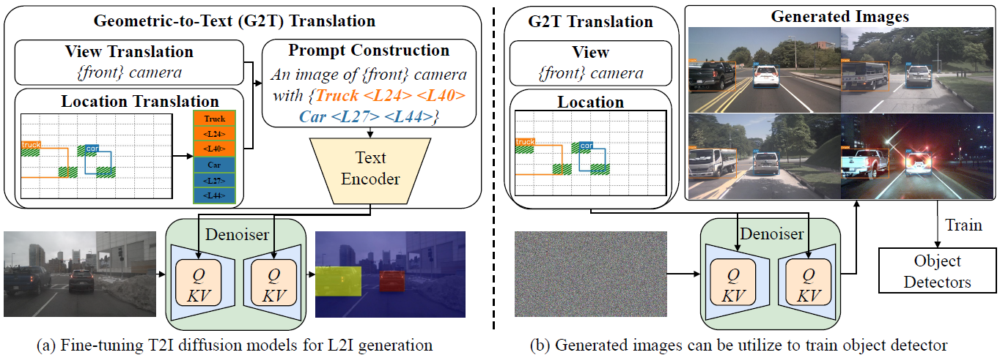
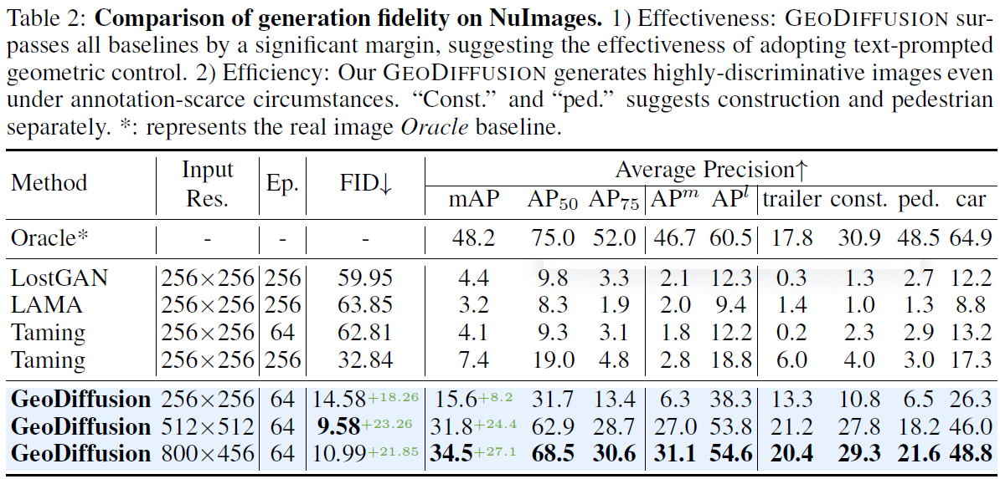
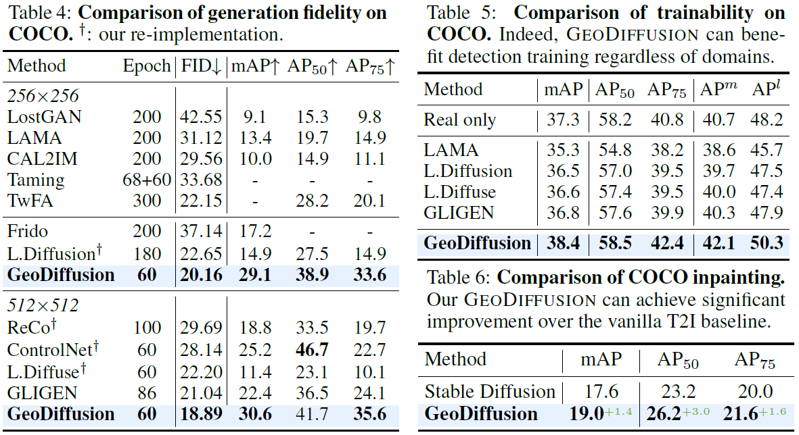

# GeoDiffusion
[](https://arxiv.org/abs/2306.04607) [](https://kaichen1998.github.io/projects/geodiffusion/)

Diffusion models have attracted significant attention due to the remarkable ability to create content and generate data for tasks like image classification. However, the usage of diffusion models to generate the high-quality object detection data remains an underexplored area, where not only image-level perceptual quality but also geometric conditions such as bounding boxes and camera views are essential. Previous studies have utilized either copy-paste synthesis or layout-to-image (L2I) generation with specifically designed modules to encode semantic layouts. In this paper, we propose GeoDiffusion, a simple framework that can flexibly translate various geometric conditions into text prompts and empower pre-trained text-to-image (T2I) diffusion models for high-quality detection data generation. Unlike previous L2I methods, our GeoDiffusion is able to encode not only the bounding boxes but also extra geometric conditions such as camera views in self-driving scenes. Extensive experiments demonstrate GeoDiffusion outperforms previous L2I methods while maintaining 4x training time faster. To the best of our knowledge, this is the first work to adopt diffusion models for layout-to-image generation with geometric conditions and demonstrate that L2I-generated images can be beneficial for improving the performance of object detectors.

## Method



## Detection Data Generation with GeoDiffusion

Coming soon.

## Train GeoDiffusion

Coming soon.

## Quantitative Results

Compare GeoDiffusion with other methods for generation quality:





## Qualitative Results

More results can be found in the main paper.


## Citation

```bibtex
@article{chen2023integrating,
  author    = {Chen, Kai and Xie, Enze and Chen, Zhe and Hong, Lanqing and Li, Zhenguo and Yeung, Dit-Yan},
  title     = {Integrating Geometric Control into Text-to-Image Diffusion Models for High-Quality Detection Data Generation via Text Prompt},
  journal   = {arXiv: 2306.04607},
  year      = {2023},
}
```

