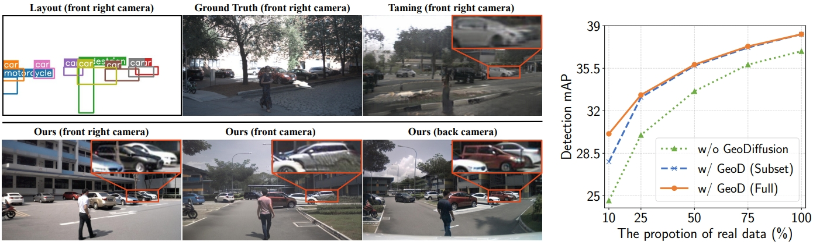
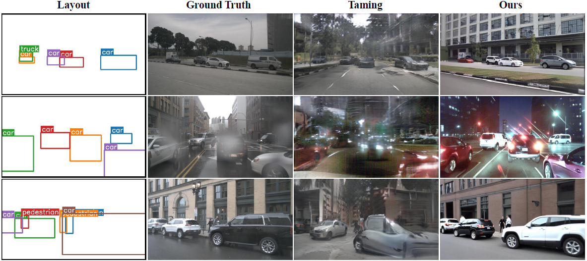
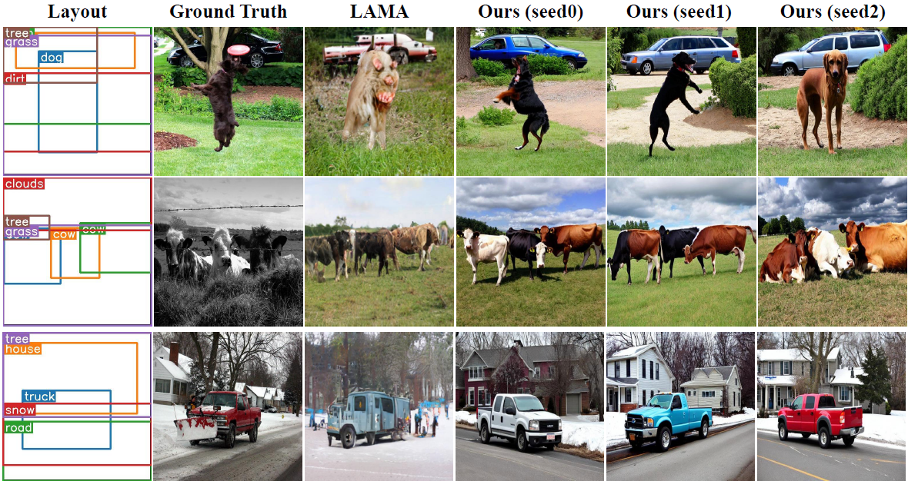

# GeoDiffusion
[](https://arxiv.org/abs/2306.04607) [](https://kaichen1998.github.io/projects/geodiffusion/)

This repository contains the implementation of the paper:

> GeoDiffusion: Text-Prompted Geometric Control for Object Detection Data Generation <br>
> [Kai Chen](https://kaichen1998.github.io/), [Enze Xie](https://xieenze.github.io/), [Zhe Chen](https://czczup.github.io/), [Yibo Wang](https://openreview.net/profile?id=~Yibo_Wang7), [Lanqing Hong](https://scholar.google.com/citations?hl=zh-CN&user=2p7x6OUAAAAJ&view_op=list_works&sortby=pubdate), [Zhenguo Li](https://scholar.google.com/citations?user=XboZC1AAAAAJ&hl=zh-CN), [Dit-Yan Yeung](https://sites.google.com/view/dyyeung/home) <br>
> *International Conference on Learning Representations (ICLR), 2024.*




## Installation

Clone this repo and create the GeoDiffusion environment with conda. We test the code under `python==3.7.16, pytorch==1.12.1, cuda=10.2` on Tesla V100 GPU servers. Other versions might be available as well.

1. Initialize the conda environment:

   ```bash
   git clone https://github.com/KaiChen1998/GeoDiffusion.git
   conda create -n geodiffusion python=3.7 -y
   conda activate geodiffusion
   ```

2. Install the required packages:

   ```bash
   cd GeoDiffusion
   pip install -r requirements/dev.txt
   ```


## Download Pre-trained Models

|        Dataset        | Image Resolution | Grid Size |                           Download                           |
| :-------------------: | :--------------: | :-------: | :----------------------------------------------------------: |
|       nuImages        |     256x256      |  256x256  | [HF Hub](https://huggingface.co/KaiChen1998/geodiffusion-nuimages-256x256) |
|       nuImages        |     512x512      |  512x512  | [HF Hub](https://huggingface.co/KaiChen1998/geodiffusion-nuimages-512x512) |
| nuImages_time_weather |     512x512      |  512x512  |                            HF Hub                            |
|      COCO-Stuff       |     256x256      |  256x256  | [HF Hub](https://huggingface.co/KaiChen1998/geodiffusion-coco-stuff-256x256) |
|      COCO-Stuff       |     512x512      |  256x256  | [HF Hub](https://huggingface.co/KaiChen1998/geodiffusion-coco-stuff-512x512) |


## Detection Data Generation with GeoDiffusion

Download the pre-trained models and put them under the root directory. Run the following commands to run detection data generation with GeoDiffusion. For simplicity, we embed the layout definition process in the file `run_layout_to_image.py` directly. Check [here](./run_layout_to_image.py#L75-L82) for detailed definition.

```bash
python run_layout_to_image.py $CKPT_PATH --output_dir ./results/
```


## Train GeoDiffusion

Coming soon.


## Qualitative Results

More results can be found in the main paper.






## The GeoDiffusion Family

We aim at constructing a controllable and flexible pipeline for perception data and corner case generation for all vision modalities! Check our latest works:

- [GeoDiffusion](https://kaichen1998.github.io/projects/geodiffusion/): text-prompted geometric controls for 2D object detection.
- [MagicDrive](https://gaoruiyuan.com/magicdrive/): multi-view street scene generation for 3D object detection.
- [TrackDiffusion](https://kaichen1998.github.io/projects/trackdiffusion/): multi-object video generation for MOT tracking.
- [Geom-Erasing](https://arxiv.org/abs/2310.05873): geometric controls for implicit concept removal.


## Citation

```bibtex
@article{chen2023integrating,
  author    = {Chen, Kai and Xie, Enze and Chen, Zhe and Hong, Lanqing and Li, Zhenguo and Yeung, Dit-Yan},
  title     = {Integrating Geometric Control into Text-to-Image Diffusion Models for High-Quality Detection Data Generation via Text Prompt},
  journal   = {arXiv: 2306.04607},
  year      = {2023},
}
```

